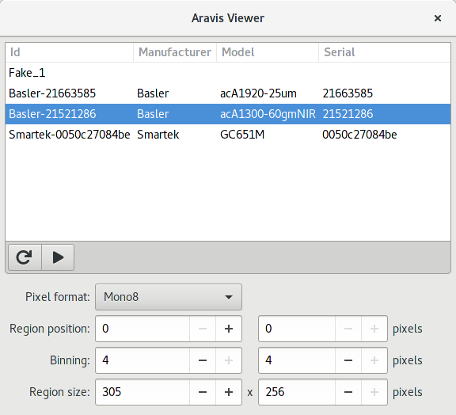
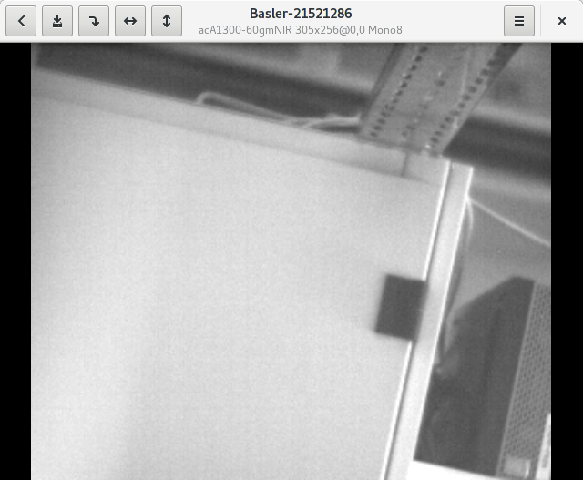

#  Aravis

### What is Aravis ?

Aravis is a glib/gobject based library for video acquisition using Genicam cameras. It currently implements the gigabit ethernet and USB3 (Since Aravis 0.5.x) protocols used by industrial cameras. It also provides a basic ethernet camera simulator and a simple video viewer.

# 
# 

Aravis is released under the LGPL v2+.

### Building Aravis

Aravis uses the standard GNU build system, using autoconf for package configuration and resolving portability issues, automake for building makefiles that comply with the GNU Coding Standards, and libtool for building shared libraries on multiple platforms. The normal sequence for compiling and installing Aravis is thus:

```
./configure
make
make install
```

Compilation options may be passed to the configure script. Please run `./configure --help` for information about the available options.

On some platforms (like Ubuntu), you may have to configure the dynamic linker (ld) to let it know where the aravis libraries are installed, and run ldconfig as root in order to update ld cache.

#### Building on Mac OS X

Using the GNU build system on Mac OS X is not directly supported, but can be mimicked by augmenting the install procedure above with some environment settings:

```
brew install gettext intltool gtk-doc
brew link --force gettext
aclocal
autoconf
autoheader
glibtoolize --copy
automake --add-missing
./configure
```

Realtime tests do not work with Mac OS, so you'll have to disable them by manually editing `tests/Makefile.am` to remove or comment the line `realtime-test`. Then you can proceed with `make`:

```
make
make install
```

### Ethernet Device Performance

#### Stream Packet Size

One way to increase streaming performance is to increase the stream packet size. arv_camera_gv_set_packet_size() (and arv_camera_gv_auto_packet_size() since Aravis 0.5.X) allows you to change this parameter. By default, the network adapter of your machine will probably not let you receive packet bigger than 1500 bytes, which is the default Maximum Transfer Unit (MTU). It means if you want to use big packets, you also have to increase the network adapter MTU to a greater walue (8192 bytes being a recommended value). The exact procedure to change the MTU depends on the distribution you are using. Please refer to the administrator manual of your distribution.

On Fedora, MTU can be changed using the network setting panel. Edit the wired network settings. MTU parameter is in the Identity page.

Please note if your device is not connected directly to the machine, you may also have to tweak the active devices on your network.

#### Packet Socket Support (Since Aravis 0.5.x)

Aravis can use packet sockets for the video receiving thread. But this mode requires extended capabilities. If you want to allow your application to use packet socket, you must set the `cap_net_raw` capability using `setcap`. For example, the following command gives this capability to the Aravis viewer (You should do this on the installed arv-viewer executable, has the one in the source tree is just a wrapper shell script):

```
sudo setcap cap_net_raw+ep arv-viewer
```

### Dependencies

The Aravis library depends on libxml2 and glib2, with an optional USB support depending on libusb1, and an optional packet socket support depending on libaudit.

The GStreamer plugin depends on GStreamer1 in addition to the Aravis library dependencies.

The simple viewer depends on GStreamer1, Gtk+3, libnotify and the Aravis library dependencies.

The required versions are specified in the [configure.ac](https://github.com/AravisProject/aravis/blob/master/configure.ac#L67) file in Aravis sources.

It is perfectly possible to only build the library, reducing the dependencies to the bare minimum.

### Downloads

* 0.4.x stable releases: http://ftp.gnome.org/pub/GNOME/sources/aravis/0.4/
* 0.5.x development releases: http://ftp.gnome.org/pub/GNOME/sources/aravis/0.5/

### Links

* Github repository: https://github.com/AravisProject/aravis
* Mailing list: aravis@freelists.org ( http://www.freelists.org/list/aravis )
* Aravis 0.4 documentation: https://aravisproject.github.io/docs/aravis-0.4/
* Aravis 0.5 (unstable) documentation: https://aravisproject.github.io/docs/aravis-0.5/
* Blog: http://blogs.gnome.org/emmanuel/category/aravis/
* Genicam standard : http://www.genicam.org
